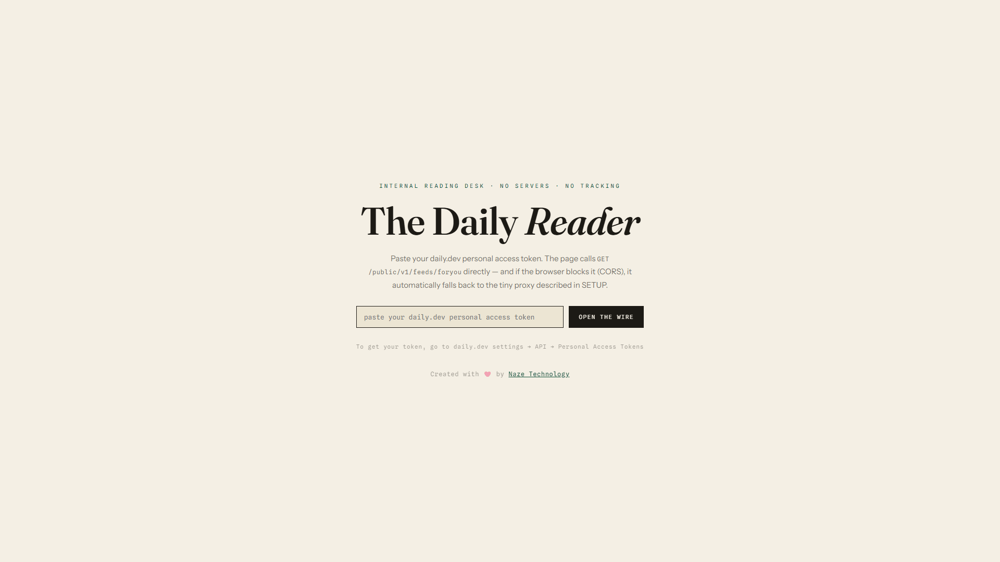

<p align="center">
  
</p>

<p align="center">
  <strong>A focused, privacy-conscious reading desk for the daily.dev public feed</strong>
</p>

<p align="center">
  
  
  
  
  
</p>

<p align="center">
  
</p>

---

## Overview

The Daily Reader is a lightweight reading desk for the [daily.dev](https://daily.dev/) public feed. It turns a busy stream of developer stories into a calm, keyboard-friendly workspace for reading, filtering, saving, and exporting.

It runs as a plain static web app with no build step and no frontend package installation. Use direct API requests when your browser permits them, or route requests through the included PHP or Node.js proxy when CORS gets in the way.

## Features

- Focused feed with cursor-based pagination and a **LOAD MORE POSTS** workflow.
- Fast filters for all posts, unread posts, saved posts, tags, local text filtering, keyword search, and semantic search.
- Local read history and saved posts stored in the browser, not in a hosted database.
- Profile lookup, article previews, direct article links, and hover image peek.
- One-click Markdown export for the currently visible list.
- Keyboard shortcuts for moving through the feed, saving posts, marking posts read, and opening setup.
- Direct, PHP proxy, and Node.js proxy routing options.
- Responsive layout with reduced-motion support and no frontend build toolchain.

## Requirements

- A modern web browser.
- A daily.dev personal access token.
- PHP with cURL or Node.js only when a proxy is needed for CORS.

## Quick Start

1. Open the [live reader](https://daily.naze.in/) or serve the repository locally.
2. Enter your own daily.dev token in **SETUP**.
3. Choose the direct route, or configure `/proxy.php` or `http://localhost:8010`.
4. Select **OPEN THE WIRE** and start reading.

## Search

The search box supports three modes:

- `keyword` calls `GET /recommend/keyword?q=...` and is best for exact technical terms such as `RAG`, `pgvector`, or `LangChain`.
- `semantic` calls `GET /recommend/semantic?q=...` for natural-language questions. The daily.dev docs mark this endpoint as deprecated, so keyword remains the default.
- `local` filters the posts already loaded in the browser by title, summary, source, and tags.

Press `Enter` in the search box or use the search button to run keyword or semantic search. Keyword results support cursor pagination when daily.dev returns a cursor.

The token is entered in your browser and is not committed to this repository, URL, or README.

## Run Locally

### Static frontend

```powershell
py -m http.server 8000
```

Open [http://localhost:8000](http://localhost:8000), then configure the API in **SETUP**.

### PHP proxy

```powershell
php -S localhost:8000
```

Open [http://localhost:8000](http://localhost:8000), set the proxy URL to `/proxy.php`, and select the `proxy` route.

### Node.js proxy

Run the static frontend in one terminal and the proxy in another:

```powershell
py -m http.server 8000
node .\daily-proxy.js
```

The Node.js proxy listens on `http://localhost:8010` by default. Use that address in **SETUP** with the `auto` or `proxy` route.

PHP and Node.js are alternative proxy options. You do not need to run both.

## Deployment

### Shared hosting

Upload `index.html` and `proxy.php` to the web root of a PHP host with cURL enabled. Keep the frontend and proxy on the same HTTPS domain when possible.

### VPS or Node host

Serve `index.html` with any static web server and keep `daily-proxy.js` running as a small Node.js service. Set the public proxy URL in **SETUP** and use HTTPS in production.

## Privacy and Security

- Each user supplies their own daily.dev token.
- Read state, saved posts, and configuration are kept in that browser's local storage.
- The included proxies forward requests and do not intentionally persist tokens or API responses.
- Never put a token in an issue, screenshot, URL, source file, or public post.
- Revoke the token or clear browser storage when using a shared computer.

For the strongest privacy boundary, run the reader and proxy on infrastructure you control.

## Project Files

- [index.html](index.html) - the complete frontend application.
- [proxy.php](proxy.php) - optional PHP daily.dev API proxy.
- [daily-proxy.js](daily-proxy.js) - optional Node.js daily.dev API proxy.
- [assets/daily-reader-tour.gif](assets/daily-reader-tour.gif) - README feature tour.
- [LICENSE](LICENSE) - MIT license.

## Contributing

1. Fork the repository.
2. Create a focused feature or fix branch.
3. Do not add tokens or other secrets.
4. Test the reader in a browser.
5. Run `node --check .\daily-proxy.js` when changing the Node.js proxy.
6. Run `php -l .\proxy.php` when changing the PHP proxy.
7. Open a pull request with clear testing notes.

Questions and bug reports belong in the repository's issue tracker. Please include your browser, operating system, setup route, and the relevant error message, but never include your API token.

## License

This project is available under the [MIT License](LICENSE).
